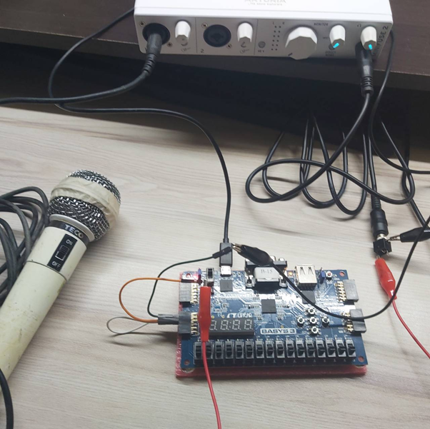

# Basys3 Pitch Estimation Project

This repository contains part of my final project for a course, featuring a simple pitch estimation (F0 estimation) system designed for the Basys3 FPGA board by Digilent. The approach uses the autocorrelation method, constrained to a C pentatonic scale for simplicity, compatibility with other project components, and to accommodate the computational resource limitations of the board.

## Project Overview

### Key Components

- **Sampler & Buffer Writer**: Receives audio signals from the vauxp15/vauxn15 pair and writes data into a buffer.
- **Dual Buffer Strategy**: Utilizes two constantly switching buffers: one for the sampler to write into and one for the F0 estimation module to read from. This drastically simplifies the design.
- **F0 Estimation**: Computes the autocorrelation values for the notes C, D, E, G, and A, and interprets the results in a one-hot-like format. The detected note is displayed on `led[4:0]`, with the most significant bit representing C.

### Status

This project is **deprecated** as the semester has ended, and I no longer have access to the Basys3 board.

### Logic Diagram

For a detailed logic diagram, refer to this [Google Drive link](https://drive.google.com/file/d/1hagkPiVFUfi8VOxSTsfXT4U0Y9-H8cEv/view?usp=sharing).

## Notes

This project serves as an educational exploration of audio signal processing on an FPGA. It is not fully polished or production-ready but demonstrates foundational concepts and practical implementation.

## How to Connect Audio

Here's a picture for reference. The audio interface is used as a amplifier only, if you also want to do that, make sure your audio interface has the direct monitoring feature.

